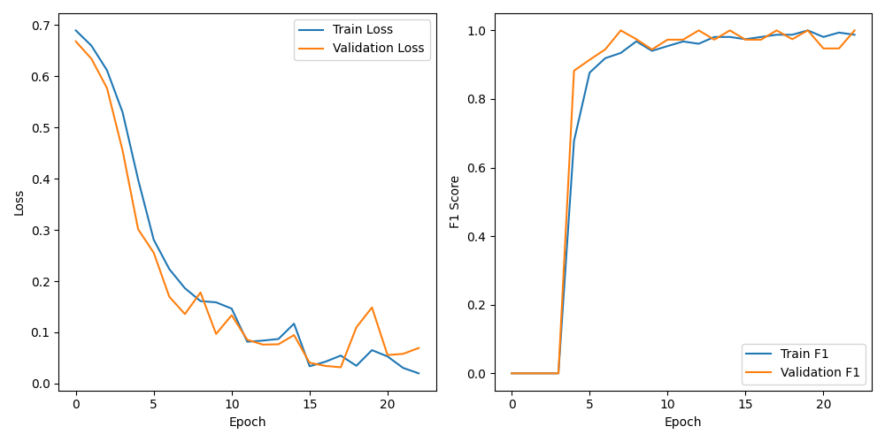

# 프로젝트 설치 방법

## 프로젝트 구조


ai_practice의 부모 폴더로 되돌아가서, 해당 폴더에 있는 pyproject.toml을 사용하여 라이브러리를 설치해야 합니다.
설치 방법은 아래와 같습니다.
```shell
poetry install # 라이브러리 설치
poetry shell # 가상환경 실행
```

라이브러리를 설치하고 가상환경을 실행한 상태여야 정상적으로 실행됩니다.

# MNIST Dataset 인식 성능 비교

- hw2_1.py를 직접 실행하여 성능 비교 지표를 확인할 수 있습니다.
- 다운로드 받은 데이터셋은 https://www.kaggle.com/datasets/hojjatk/mnist-dataset 에서 구했습니다.
- kNN, SVM 모델과 특징점 추출 방법인 SIFT, HOG, ORB를 통해 어떤 방법이 더 성능이 좋은지에 대해 알 수 있습니다.

### 실행 방법
```shell
python hw2_1.py
```

# Empire state building 학습 및 인식

- hw2_2.py를 직접 실행하여 모델을 학습할 수 있습니다.
- **empire, empire_test, not_empire, not_empire_test** 디렉토리를 생성하고 직접 하나씩 학습 이미지를 디렉토리에 넣어주셔야 합니다.
- 단순히 저도 구글링을 통해 데이터를 하나씩 수집한것이라, 데이터를 공유하는것은 힘들 것 같습니다.
- empire, not_empire 디렉토리에 들어가는 데이터 개수는 100개 정도입니다.
- empire_test와 not_empire_test에는 갯수 상관 없이 이미지 집어넣으시면 됩니다. -> 이걸로 나중에 실행할 때 image_path 인자에 넣어서 검증합니다.
- 최초 hw2_2.py 실행 시 모델이 생성되어 있지 않다면 학습을 먼저 진행합니다.
- 모델 학습 시 자동으로 test_data 디렉토리와 training_data 디렉토리를 생성하고 라벨링합니다. (ImageFolder 객체 사용)
- **학습된 모델이 이미 존재한다면 인자로 넘겨주는 이미지 내부에 Empire state building이 존재하는지 확인해줍니다.**
- 제가 진행한 모델 학습 그래프는 아래와 같습니다.



### 실행 방법
```shell
python hw2_2.py image_path
```

# Empire state buildig 탐지

- hw2_3.py를 직접 실행하여 Empire state building을 탐지할 수 있습니다.
- 사전에 hw2_2.py를 실행하여 모델이 생성되어 있어야 합니다. 이 모델을 기반으로 탐지를 수행하게 됩니다.
- 만약 Empire state building이 이미지 내부에 존재한다면 빨간색 박스로 표시됩니다.
- 만약 존재하지 않는다면 아무런 표시가 나타나지 않습니다.

### 실행 방법
```shell
python hw2_3.py image_path
```
